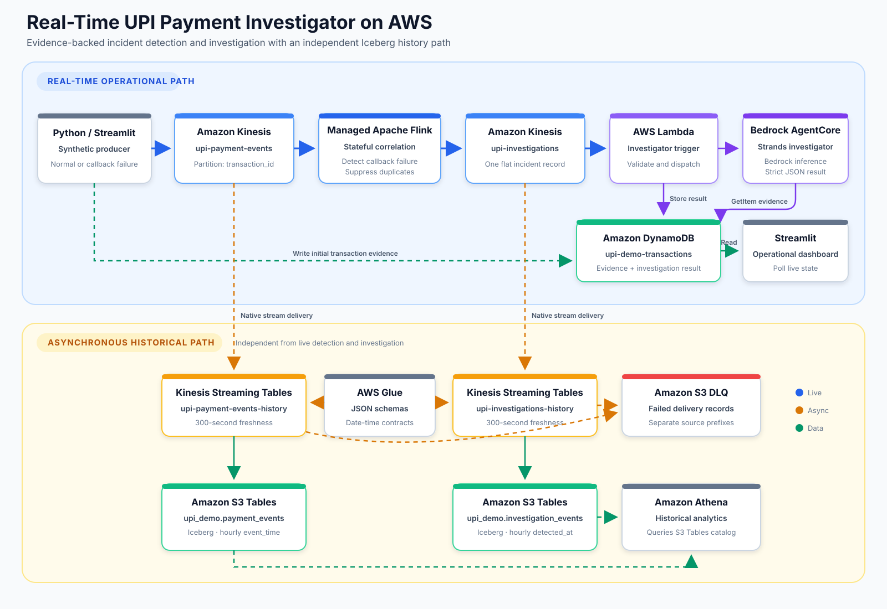

# Real-Time UPI Payment Investigator on AWS

## Problem statement

Digital payment processing is distributed across customer-facing applications,
payment networks, beneficiary systems, and merchant applications. A transfer
can complete successfully while the final merchant callback fails. In that
situation, the beneficiary may already have received the funds even though the
merchant application still shows the order as pending or failed.

Without correlated evidence, an operations or support team may need to search
several systems before answering basic questions:

- Was the payer debited successfully?
- Did the payment network process the transfer?
- Was the beneficiary credited?
- Did only the merchant notification fail?
- Should the merchant reconcile the order, or should the customer try again?

This project demonstrates how to answer those questions automatically from an
event stream. It detects the specific pattern where the transfer completed but
the merchant callback failed, gathers the transaction evidence, and produces a
consistent operational explanation and recommended next action.

### What the project solves

| Operational problem | Project capability | Result |
| --- | --- | --- |
| Payment state is split across multiple lifecycle events | Flink correlates events by `transaction_id` | One coherent view of the payment journey |
| A merchant-facing failure can be mistaken for a failed transfer | Detection requires successful debit, network, and beneficiary credit before a failed callback | Transfer outcome is separated from notification outcome |
| Duplicate failure events can create duplicate support work | Deterministic incident IDs and keyed Flink state suppress duplicates | At most one investigation incident per transaction |
| Investigation requires manual evidence gathering | The Strands agent retrieves the DynamoDB evidence through one constrained tool | Evidence-backed classification and root cause |
| An incorrect retry can lead to a duplicate customer payment | The recommended action targets merchant notification reconciliation | The customer is explicitly told not to pay again |
| Operational and analytical workloads have different latency needs | DynamoDB serves live state while S3 Tables stores asynchronous history | Live investigation remains independent of analytics delivery |

The primary users of this pattern are payment operations, merchant support,
site reliability engineering, and platform engineering teams. The current
implementation is intentionally limited to one synthetic incident type, but it
shows the core pattern for event correlation, evidence-backed investigation,
and operational reconciliation.

## Solution overview

This is a working, end-to-end AWS project that generates synthetic UPI-like
payment events, detects a merchant callback failure in real time, and uses a
Strands agent on Amazon Bedrock AgentCore Runtime to investigate what happened.

The project has two independent data paths:

- A real-time operational path for detection and AI-assisted investigation.
- An asynchronous historical path for Apache Iceberg analytics in Amazon S3
  Tables.

The local Streamlit dashboard uses DynamoDB for live operational state. It does
not poll Athena or S3 Tables.

> [!IMPORTANT]
> This project processes synthetic data only. It never connects to UPI, NPCI,
> BHIM, a bank, a PSP, or any real payment infrastructure. Every transaction,
> order, merchant, status, and failure is generated by the project.

## Architecture



The upper lane is the real-time operational path. The lower lane independently
archives both streams for historical audit and analytics. Historical delivery
does not participate in payment detection, Lambda dispatch, AgentCore
invocation, or live dashboard polling.

## Technical flow

1. The Python producer creates a synthetic transaction and emits five ordered
   lifecycle events to `upi-payment-events`. All events for the transaction use
   the same `transaction_id` as their Kinesis partition key.
2. The producer also writes the complete transaction evidence to
   `upi-demo-transactions`. This becomes the operational source of evidence for
   the investigator and the dashboard.
3. Amazon Managed Service for Apache Flink reads `upi-payment-events`, keys the
   stream by `transaction_id`, and maintains only the payment statuses required
   by the detection rule.
4. A normal payment reaches `MERCHANT_CALLBACK_SUCCESS`; Flink emits nothing to
   the investigation stream.
5. When debit, network processing, and beneficiary credit are all successful
   but the merchant callback has failed, Flink creates one flat incident with a
   deterministic ID and writes it to `upi-investigations`.
6. Flink records `incident_emitted` in keyed state, so a duplicate callback
   failure for the same transaction does not produce another incident.
7. The `upi-investigator-trigger` Lambda consumes the incident, validates that
   it is synthetic and has the expected deterministic ID, and invokes the
   AgentCore Runtime `DEFAULT` endpoint.
8. The Strands agent calls only
   `get_transaction_evidence(transaction_id)`. That tool performs a DynamoDB
   `GetItem` and returns the limited payment evidence required for analysis.
9. Amazon Bedrock provides the model inference. The agent classifies the
   incident, explains the root cause from observed evidence, and returns the
   required strict JSON response.
10. Lambda validates the agent response and updates the DynamoDB item with
    `investigation_status = COMPLETED`, classification, root cause, evidence,
    recommended action, and customer action.
11. The local Streamlit application polls only DynamoDB and renders the payment
    journey, streaming detection, and completed AI investigation.
12. In parallel, two native Kinesis Streaming Tables channels archive payment
    and investigation events into hourly partitioned Apache Iceberg tables in
    Amazon S3 Tables. Glue JSON schemas define the record contracts used during
    delivery.

For the supported callback-failure case, the resulting operational conclusion
is that the actual transfer succeeded through beneficiary credit, while the
merchant notification or application state update failed. The appropriate next
step is to retry or reconcile the merchant notification; the customer should
not initiate another payment.

## What is implemented

| Capability | Implementation | Status |
| --- | --- | --- |
| Synthetic payment generation | Python producer with normal and callback-failure scenarios | Implemented |
| Real-time event transport | Two on-demand Kinesis data streams | Implemented |
| Stateful incident detection | PyFlink job on Amazon Managed Service for Apache Flink | Implemented |
| Investigation dispatch | Kinesis-triggered Lambda with partial batch failure handling | Implemented |
| AI investigation | One Strands agent on Bedrock AgentCore Runtime with one evidence tool | Implemented |
| Operational state | DynamoDB transaction evidence and completed investigation results | Implemented |
| Operational UI | Local Streamlit dashboard backed only by DynamoDB for live state | Implemented |
| Historical archival | Native Kinesis Streaming Tables delivery to S3 Tables/Iceberg | Implemented |
| Historical query examples | Athena SQL for the S3 Tables catalog | Documented below |

## Supported behavior

The producer supports exactly two scenarios.

### Normal payment

```text
PAYMENT_INITIATED
PAYER_DEBIT_SUCCESS
NETWORK_SUCCESS
BENEFICIARY_CREDIT_SUCCESS
MERCHANT_CALLBACK_SUCCESS
```

Expected result: the transaction completes and Flink emits no investigation.

### Merchant callback failure

```text
PAYMENT_INITIATED
PAYER_DEBIT_SUCCESS
NETWORK_SUCCESS
BENEFICIARY_CREDIT_SUCCESS
MERCHANT_CALLBACK_FAILED
```

The failed callback event includes synthetic evidence:

```json
{
  "http_status": 500,
  "error": "Merchant callback endpoint unavailable"
}
```

Flink detects the incident only when all of these statements are true:

```text
payer_debit_status == SUCCESS
network_status == SUCCESS
beneficiary_credit_status == SUCCESS
merchant_callback_status == FAILED
```

This means the transfer succeeded through beneficiary credit, while the
merchant notification/application update failed. The customer must not be
asked to pay again.

## How the implementation works

### 1. Synthetic producer

[`simulator/producer.py`](simulator/producer.py) creates one transaction and
five ordered events. Each event contains:

```text
transaction_id
event_type
event_time
amount
merchant_id
order_id
status
metadata
```

The producer:

- Sends events to `upi-payment-events` with `transaction_id` as the partition
  key.
- Uses boto3's normal AWS profile and credential chain.
- Writes the complete synthetic evidence trail to
  `upi-demo-transactions` in DynamoDB.

### 2. Stateful Flink detection

[`flink/main.py`](flink/main.py) runs the PyFlink streaming job, while
[`flink/investigator.py`](flink/investigator.py) contains the unit-testable
detection rule.

The stream is keyed by `transaction_id`. Flink retains only:

```text
payer_debit_status
network_status
beneficiary_credit_status
merchant_callback_status
callback_http_status
incident_emitted
```

For a callback failure, Flink emits exactly one flat investigation record. The
incident identifier is deterministic:

```text
<transaction_id>-MERCHANT_CALLBACK_FAILURE
```

Duplicate callback failure events do not create duplicate incidents.

The emitted incident stays intentionally flat for Lambda processing and
historical Iceberg storage:

```json
{
  "incident_id": "txn-demo-...-MERCHANT_CALLBACK_FAILURE",
  "transaction_id": "txn-demo-...",
  "incident_type": "MERCHANT_CALLBACK_FAILURE",
  "detected_at": "2026-01-01T12:00:00+00:00",
  "amount": 499.0,
  "merchant_id": "merchant-demo-001",
  "order_id": "order-demo-...",
  "payer_debit_status": "SUCCESS",
  "network_status": "SUCCESS",
  "beneficiary_credit_status": "SUCCESS",
  "merchant_callback_status": "FAILED",
  "callback_http_status": 500,
  "error_code": "MERCHANT_CALLBACK_500",
  "error_message": "Merchant callback endpoint unavailable"
}
```

### 3. Lambda dispatcher

[`lambda_trigger/handler.py`](lambda_trigger/handler.py):

- Consumes `upi-investigations` in batches of one.
- Validates the synthetic transaction and deterministic incident ID.
- Invokes the AgentCore Runtime `DEFAULT` endpoint.
- Validates the agent's strict JSON response.
- Stores the completed investigation back in DynamoDB.
- Uses partial batch failure reporting for safe Kinesis retries.

### 4. Strands investigation agent

The agent is implemented in [`agent/`](agent/) and packaged for AgentCore under
[`agentcore_project/UpIPaymentInvestigator/`](agentcore_project/UpIPaymentInvestigator/).

It has one tool:

```text
get_transaction_evidence(transaction_id)
```

The tool reads only the requested synthetic item from
`upi-demo-transactions`. The agent must inspect that evidence before forming a
conclusion and must never fabricate payment or banking status.

The response contract is strict JSON:

```json
{
  "transaction_id": "txn-demo-...",
  "incident_id": "txn-demo-...-MERCHANT_CALLBACK_FAILURE",
  "classification": "Merchant callback failure",
  "root_cause": "Merchant callback endpoint unavailable",
  "evidence": [
    "Payer debit succeeded",
    "Payment network succeeded",
    "Beneficiary credit succeeded",
    "Merchant callback failed with HTTP status 500"
  ],
  "recommended_action": "Retry/reconcile merchant notification",
  "customer_action": "No action required from the customer"
}
```

The agent cannot execute refunds, reversals, or financial transactions.

### 5. Local Streamlit dashboard

[`dashboard/app.py`](dashboard/app.py) provides two controls:

- **Generate Normal Payment**
- **Inject Merchant Callback Failure**

The page displays:

- Transaction ID, amount, merchant, and order.
- Customer debit, network, beneficiary credit, and merchant callback status.
- Flink incident ID and type.
- AgentCore investigation status, root cause, evidence, recommended action, and
  customer action.

Live information is read from DynamoDB every two seconds. The dashboard never
depends on S3 delivery freshness or Athena availability.

### 6. Historical analytics

[`infra/historical/deploy.py`](infra/historical/deploy.py) configures native
Kinesis Streaming Tables delivery for both streams.

| Source stream | Glue schema | Iceberg table | Hourly partition |
| --- | --- | --- | --- |
| `upi-payment-events` | `payment_events` | `upi_demo.payment_events` | `event_time` |
| `upi-investigations` | `investigation_events` | `upi_demo.investigation_events` | `detected_at` |

Historical configuration:

- Delivery freshness: 300 seconds.
- Compression: ZSTD.
- Table format: Apache Iceberg in Amazon S3 Tables.
- Timestamp fields: JSON Schema `string` with `format: date-time`, mapped to
  Iceberg `timestamptz`.
- Dead-letter destination: a private, encrypted general-purpose S3 bucket.
- Destination tables are created and managed by Kinesis Streaming Tables.
- Existing records are not backfilled; archival begins after a channel becomes
  active.

The source streams use a project customer-managed KMS key because native
streaming-table delivery does not support source streams encrypted with the
AWS-managed `alias/aws/kinesis` key.

## AWS resources

The deployed project uses these stable resource names:

| Resource | Name |
| --- | --- |
| Payment event stream | `upi-payment-events` |
| Investigation stream | `upi-investigations` |
| Managed Flink application | `upi-payment-investigator` |
| Lambda dispatcher | `upi-investigator-trigger` |
| AgentCore agent | `upi-payment-investigator` |
| DynamoDB table | `upi-demo-transactions` |
| Glue Schema Registry | `upi-demo-streaming-tables` |
| Glue namespace | `upi_demo` |
| Payment history table | `payment_events` |
| Investigation history table | `investigation_events` |

The S3 table bucket, artifact bucket, and historical DLQ include account/region
or CloudFormation-generated suffixes so their names are globally unique.

## Repository structure

```text
.
├── assets/                Architecture diagram used by this README
├── infra/                 Foundational CDK and historical delivery deployment
│   └── historical/        Glue JSON schemas and Streaming Tables deploy script
├── simulator/             Synthetic two-scenario payment producer
├── flink/                 PyFlink application and packaging
├── agent/                 Local Strands agent implementation and test command
├── agentcore_project/     Official AgentCore CLI project
├── lambda_trigger/        Kinesis-to-AgentCore Lambda handler
├── dashboard/             Local DynamoDB-backed Streamlit dashboard
├── scripts/               Operational runbook and readiness helpers
├── tests/                 Unit tests for all local behavior
├── Makefile               Common development and operational commands
├── requirements-dev.txt   Development dependencies
└── AGENTS.md              Repository scope and engineering guardrails
```

## Prerequisites

- Python 3.11
- An AWS profile configured for the intended project account
- AWS Region `us-east-1` for the current deployed environment
- AWS CDK v2 for foundational infrastructure work
- JDK 11, Maven, and `zip` for packaging the PyFlink application
- The official AgentCore CLI for AgentCore deployment and status commands
- Bedrock model access for the configured model

## Local setup

```bash
git clone https://github.com/<your-user>/aws-realtime-upi-payment-investigator.git
cd aws-realtime-upi-payment-investigator

python3.11 -m venv .venv
source .venv/bin/activate

python -m pip install --upgrade pip
python -m pip install -r requirements-dev.txt
python -m pip install -r dashboard/requirements.txt
python -m pip install -r agent/requirements.txt

make test
```

The unit tests use fakes at AWS adapter boundaries and do not call AWS.

## Run the project

### Start the dashboard

```bash
source .venv/bin/activate
AWS_REGION=us-east-1 streamlit run dashboard/app.py
```

The dashboard uses the currently configured boto3 profile. The credentials need
permission to publish synthetic events to `upi-payment-events`, write the
initial evidence item to DynamoDB, and read the selected DynamoDB item.

### Generate transactions from the terminal

```bash
./scripts/demo-normal.sh
./scripts/demo-failure.sh
```

Equivalent direct commands:

```bash
python simulator/producer.py --scenario normal
python simulator/producer.py --scenario callback-failure
```

Each command prints the generated `transaction_id`, record count, and Kinesis
sequence numbers.

### Check deployed readiness

```bash
./scripts/demo-check.sh
```

The readiness check verifies the deployed streams, Flink application, Lambda
mapping, AgentCore Runtime, DynamoDB table, historical channels, S3 table
bucket, Glue schemas, DLQ, and an Athena read query.

### Reset between walkthroughs

```bash
./scripts/demo-reset.sh
```

The dashboard is session-scoped, so reset is intentionally non-destructive.
The script does not delete DynamoDB evidence, Kinesis records, Iceberg history,
or AWS resources. Open a new Streamlit browser session to clear the selected
transaction.

## Historical query examples

After the S3 Tables catalog is available to Athena, select the table-bucket
catalog and the `upi_demo` database, then run queries such as:

```sql
SELECT count(*)
FROM payment_events;
```

```sql
SELECT event_type, count(*) AS event_count
FROM payment_events
GROUP BY event_type
ORDER BY event_count DESC;
```

```sql
SELECT
    transaction_id,
    incident_type,
    detected_at,
    merchant_id,
    callback_http_status
FROM investigation_events
ORDER BY detected_at DESC;
```

```sql
SELECT incident_type, count(*) AS incidents
FROM investigation_events
GROUP BY incident_type;
```

## Development commands

| Command | Purpose |
| --- | --- |
| `make test` | Run all unit tests |
| `make cdk-synth` | Synthesize the foundational CloudFormation template |
| `make cdk-diff` | Compare foundational infrastructure with AWS |
| `make flink-package` | Build the PyFlink deployment archive |
| `make dashboard` | Start the local Streamlit dashboard |
| `make demo-normal` | Generate one normal synthetic payment |
| `make demo-failure` | Generate one callback failure |
| `make demo-check` | Run deployed readiness checks |
| `make demo-reset` | Show the non-destructive reset procedure |
| `make historical-deploy` | Deploy/update the historical path and required stream-key configuration |

## Infrastructure and deployment boundaries

The repository intentionally separates the deployment mechanisms used by the
project:

1. [`infra/upi_demo_stack.py`](infra/upi_demo_stack.py) defines the foundational
   CDK resources: two Kinesis streams, DynamoDB, and the Flink artifact bucket.
2. [`flink/package.sh`](flink/package.sh) packages the Python application and
   Kinesis connector for the existing Managed Flink application.
3. [`agentcore_project/UpIPaymentInvestigator/`](agentcore_project/UpIPaymentInvestigator/)
   is deployed with the official AgentCore CLI workflow.
4. [`lambda_trigger/handler.py`](lambda_trigger/handler.py) is the deployed
   Lambda handler; least-privilege policy documents are kept under `infra/`.
5. [`infra/historical/deploy.py`](infra/historical/deploy.py) creates or updates
   the parallel S3 Tables path through current boto3 APIs.

The foundational CDK stack does not represent the entire running architecture.
Running `cdk deploy` alone does not deploy Flink, Lambda, AgentCore, or the
historical channels.

Commands that synthesize or test are local-only. Commands named `deploy` or
`historical-deploy` mutate AWS resources and should be run only against the
intended project account and Region.

## Configuration

| Component | Variable | Default |
| --- | --- | --- |
| Simulator | `AWS_REGION` | boto3 configuration |
| Flink | `INPUT_STREAM_ARN` | Payment stream ARN configured for the project account |
| Flink | `OUTPUT_STREAM_ARN` | Investigation stream ARN configured for the project account |
| Flink | `AWS_REGION` | `us-east-1` |
| Lambda | `TABLE_NAME` | `upi-demo-transactions` |
| Lambda | `AGENT_RUNTIME_ARN` | required in AWS |
| Agent | `TABLE_NAME` | `upi-demo-transactions` |
| Agent | `BEDROCK_MODEL_ID` | `amazon.nova-lite-v1:0` |
| Agent | `AWS_REGION` | `us-east-1` |
| Dashboard | `TABLE_NAME` | `upi-demo-transactions` |
| Release scripts | `PYTHON_BIN` | `.venv/bin/python` |

## Testing

```bash
make test
```

The suite covers:

- Both producer scenarios and exact event sequences.
- Callback failure metadata.
- Normal payment producing zero incidents.
- Callback failure producing exactly one incident.
- Duplicate callback failure suppression.
- Flat investigation event shape and deterministic incident IDs.
- Agent input, evidence access, and strict output validation.
- Lambda decoding, AgentCore invocation, result storage, and partial failures.
- Dashboard mapping for normal, pending, and completed transactions.
- Glue schemas matching the producer and Flink output contracts.

## IAM and security model

The project uses separate execution roles for Flink, Lambda, AgentCore, and each
historical delivery channel.

- Flink reads only `upi-payment-events`, writes only `upi-investigations`, reads
  its application artifact, and writes its configured logs/checkpoints.
- Lambda reads only `upi-investigations`, invokes the configured AgentCore
  Runtime, updates `upi-demo-transactions`, and writes its logs.
- AgentCore invokes the configured Bedrock model and performs `GetItem` only on
  `upi-demo-transactions`.
- Historical delivery roles read their Glue schema, decrypt only their source
  stream, write only the configured S3 table bucket, and write failures only to
  their DLQ prefix.
- The dashboard and producer use the developer's currently configured boto3
  profile; no credentials are stored in the repository.

## Deliberate scope limits

- Synthetic transactions only.
- One incident type: `MERCHANT_CALLBACK_FAILURE`.
- One agent and one DynamoDB evidence tool.
- No AgentCore Gateway, AgentCore Memory, MCP, or knowledge base.
- No Firehose, Glue ETL, Spark, custom Iceberg writer, or Lambda archival path.
- No automated refunds, reversals, retries, or other financial actions.
- No production fraud scoring, payment decisioning, or customer data.

## AWS references

- [Amazon Kinesis Data Streams](https://docs.aws.amazon.com/streams/latest/dev/introduction.html)
- [Python applications for Managed Service for Apache Flink](https://docs.aws.amazon.com/managed-flink/latest/java/how-python.html)
- [Amazon Bedrock AgentCore Runtime](https://docs.aws.amazon.com/bedrock-agentcore/latest/devguide/runtime.html)
- [Amazon S3 Tables](https://docs.aws.amazon.com/AmazonS3/latest/userguide/s3-tables.html)
- [Querying S3 Tables with Athena](https://docs.aws.amazon.com/AmazonS3/latest/userguide/s3-tables-integrating-athena.html)

## License

Add the license appropriate for your GitHub repository before publishing.
